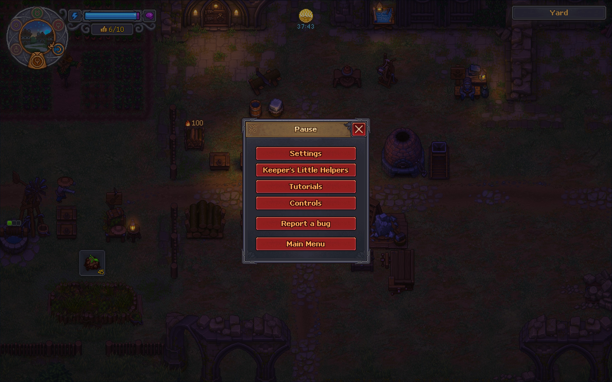
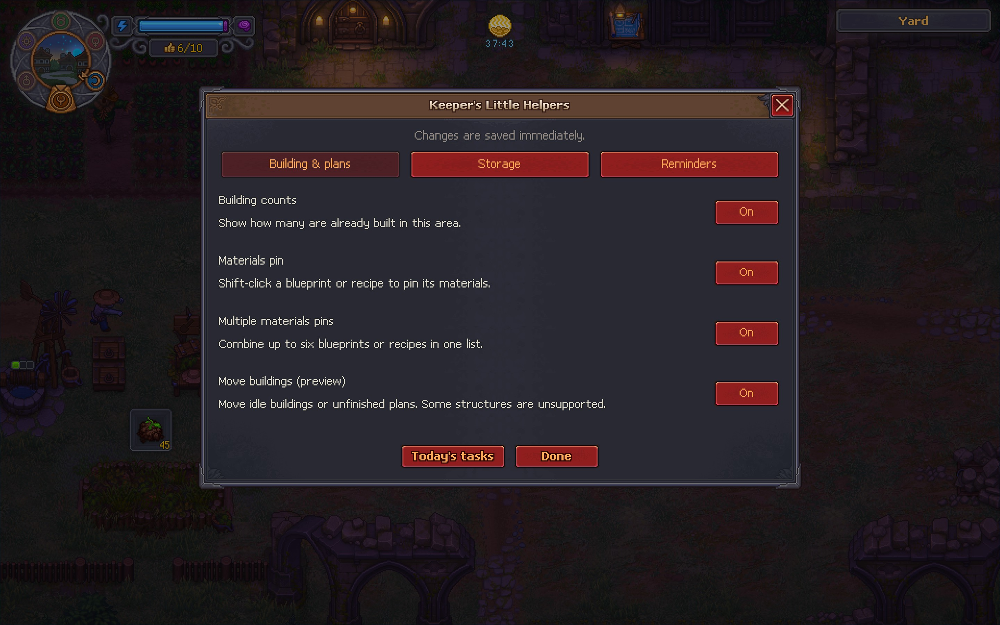
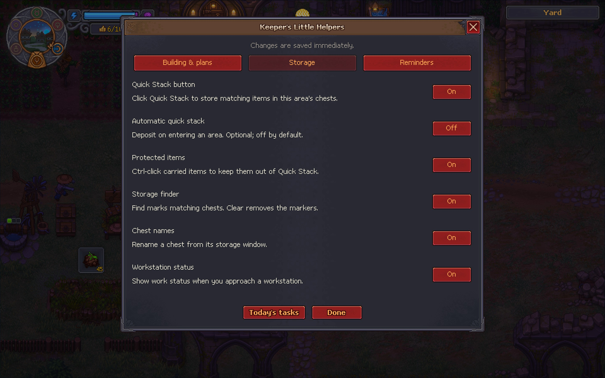
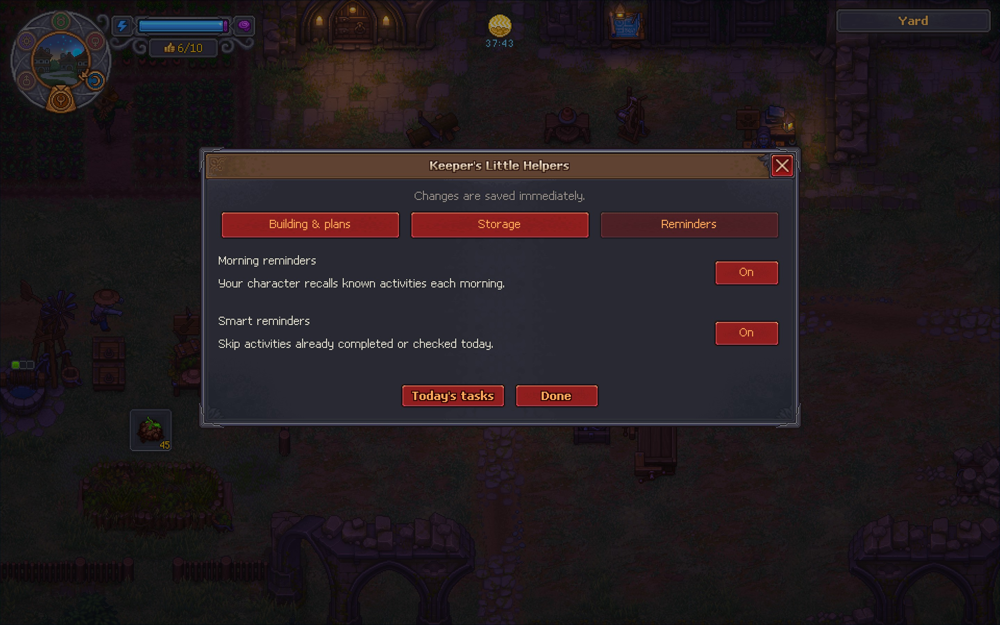
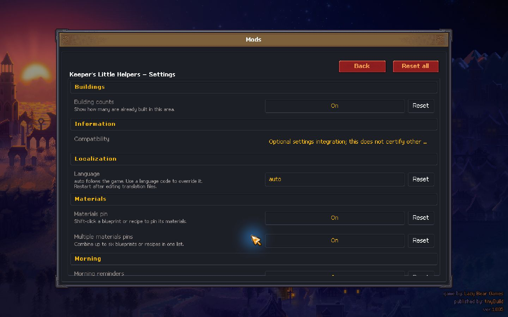

# Keeper's Little Helpers

A growing quality-of-life pack for Graveyard Keeper 2, using the game's own interface.

[Download on Nexus Mods](https://www.nexusmods.com/graveyardkeeper2/mods/111) | [GitHub releases](https://github.com/espenl/keepers-little-helpers/releases)

## Version 0.3.7

Adds crafting recipe pins, editable UTF-8 JSON translations, automatic game-language selection with English fallback, and a separate optional GK2 Mod Framework settings bridge. See TRANSLATING.md and FRAMEWORK.md. Community language files can be partial; this build includes the complete English template. No complete French translation is included yet.

Choose your helpers from one native settings menu:

- **Building counts:** compact `Built: 1` labels in the native building menu. Kitchen upgrades show `Current: Tier I` or `Current: Tier II`. Zero counts stay hidden. Counts apply to the building desk's area.
- **Materials pins:** Shift-click to pin or unpin up to six different blueprints or crafting recipes. The native panel combines their materials and stays visible in building and crafting menus. Recipes use the selected ingredients and craft count; pinning does not start work. Fuel and tool durability are not included. Carrying / Need counts exclude chests. Each plan has a remove X; the header X clears all pins. Drag the header to move the panel; long lists scroll. Pins last for the session.
- **World projects:** For world repair/build prompts such as the vineyard bridge, Shift-click the project output icon to pin its requirements without adding buttons to the native menu.
- **Storage finder:** click Find beside a pinned material to mark matching chests in the current area. Find item searches by name. Results identify chest contents separately from carried items, refresh while active, and clear after one minute or leaving the area. Clear removes markers immediately.
- **Quick Stack:** a bottom-left button deposits matching item types into this area's existing chest stacks. Bags and tool-belt items stay untouched. Automatic deposit on area entry is optional and OFF by default; loading a save does not trigger it.
- **Protected items:** Ctrl-click a carried item to protect all stacks of that item type from the helper's Quick Stack; Ctrl-click again to remove protection. Protected items show Keep. This does not alter vanilla deposit buttons.
- **Chest names:** choose Rename chest in its storage window. Blank restores the default name. Names and protected item types persist per character/object.
- **Workstation status:** approaching a station shows ready output, missing fuel, or blocked output when applicable. No persistent helper icons across the area; autopsy tables are excluded.
- **Move buildings (preview):** select Move at a building desk, select an idle structure or supported unfinished blueprint, then click a valid spot in the same area. Right-click cancels. Normal yard workstations and nearby tool-rack bonuses are supported.
- **Morning reminders:** the player thinks aloud about known activities after dawn. Reminders wait until you are free to act. Smart reminders skip completed or checked activities. Today's tasks allows manual checkoff. Press **F8** to repeat today's reminders.

The menu annotates only recipes the game already displays. Reminders use activity unlocks and available readiness flags to avoid revealing future activities. The building menu and settings use native UI, and the materials panel uses the game's font and panel artwork.

## Requirements

Tested on Windows x64, Steam build 25506711, game version 1.005.
Requires [BepInEx 5.4.23.5 x64](https://github.com/BepInEx/BepInEx/releases/tag/v5.4.23.5), installed separately. Compatibility with other game versions or platforms is unverified.

## Installation

1. Close the game and back up your saves.
2. If BepInEx is not installed, extract its Windows x64 release into the game folder containing `GraveyardKeeper2.exe`. Launch the game once, then close it.
3. Extract this pack's ZIP into that same game folder. The result should be `BepInEx/plugins/KeepersJournal/KeepersJournal.dll`.
4. Start the game and open a building desk. Existing structures should have compact status labels.

For an update, close the game and extract the new ZIP, replacing the DLL and English catalog while keeping any community translation files. Keep only one copy of the plugin installed.

## Settings and removal

Open **Esc > Keeper's Little Helpers**. Choose **Building & plans**, **Storage**, or **Reminders**, then click the On/Off button beside a helper. Short descriptions explain each option and any dependency. Settings save immediately.

Advanced settings remain in `BepInEx/config/local.espen.keepersjournal.cfg`, including quiet-morning messages, reminder duration, and the optional F8 repeat shortcut. Close the game before editing that file.

To uninstall, close the game and remove `BepInEx/plugins/KeepersJournal/KeepersJournal.dll`. Moves already saved remain in your save. Back up saves before using the moving preview.

## Validation and known limits

4,902 automated rule checks pass. Five isolated tests with the game's inventory API checked matching deposits, protected types, partial capacity and item conservation. These checks do not replace gameplay/UI testing. Moving remains a preview; not every structure or full calendar activity cycle has been verified. Daily checkoffs are local per-character/day settings; loading an earlier save from the same day may retain them.

Moving keeps the original structure data, inventory, and upgrades. Active/queued work, assigned workers, fitted attachments, planted beds, and special/scripted structures remain restricted. Only ordinary yard placement areas and structures without a special placement area are supported. Tool-rack links are recalculated after moving; other linked equipment remains restricted.

Messages fall back to English until a translation for the selected language is installed. Unknown script-only building actions are left without a count. Garden and vineyard counts include planted and harvest-ready plots. Counts otherwise distinguish exact structure types; fixed house storage is not counted as a player-built chest recipe. Game updates may require a plugin update.

For a bug report, include the game build, pack version, building desk and recipe involved, expected versus displayed count, and relevant lines from `BepInEx/LogOutput.log`. Avoid sharing your save unless needed.

## Credits

Created by Kontuu. Uses BepInEx and Harmony at runtime and the game's existing interface. This is an unofficial community mod, not affiliated with the game developers.

## Development

Source and bug reports: https://github.com/espenl/keepers-little-helpers

Build on Windows using `powershell -File tools/build.ps1 -GameDirectory "YOUR_GAME_FOLDER"`. This requires the installed game and BepInEx; their assemblies are not redistributed. Run `powershell -File tools/test.ps1` for the standalone rules checks. Run `python tools/package.py` to create the release ZIP.

## Native helper settings

## Optional Framework settings

