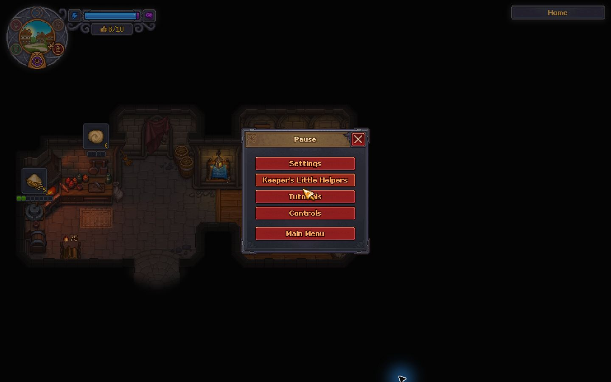
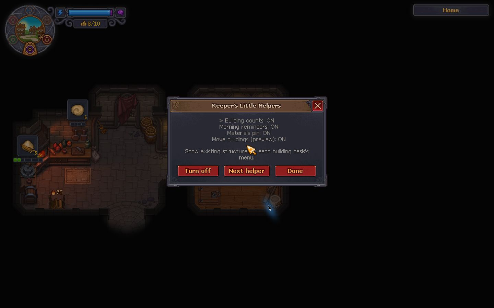
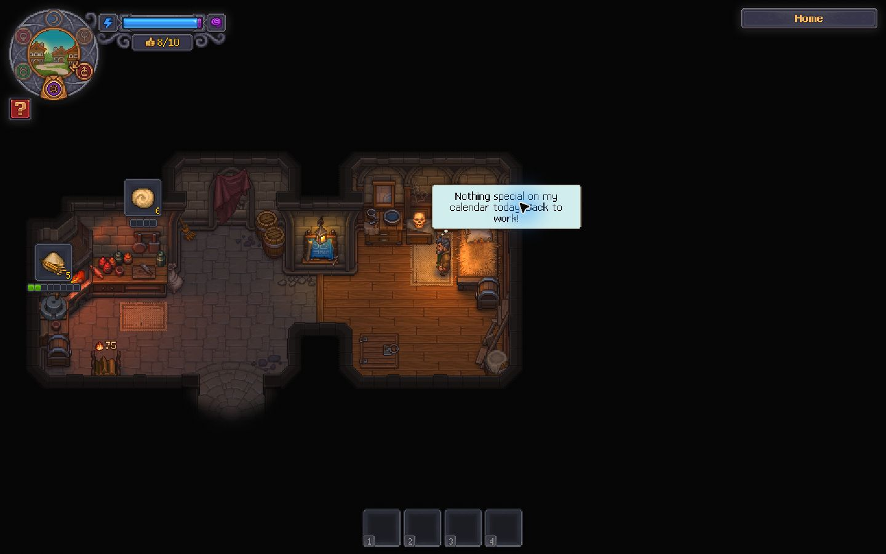

# Keeper's Little Helpers

A growing quality-of-life pack for Graveyard Keeper 2, using the game's own interface.

[Download on Nexus Mods](https://www.nexusmods.com/graveyardkeeper2/mods/111) | [GitHub releases](https://github.com/espenl/keepers-little-helpers/releases)

## Version 0.3.3 - public preview

Four independently switchable helpers are included in one plugin:

- **Building counts:** compact `Built: 1` labels in the native building menu. Kitchen upgrades show `Current: Tier I` or `Current: Tier II`. Zero counts stay hidden. Counts apply to the building desk's area.
- **Materials pin:** Shift-click a blueprint to track its required materials in a side panel. Counts show carried inventory. Click the X to clear it; pins last for the current session.
- **Move buildings (preview):** select Move at a building desk, select an idle structure, then click a valid spot in the same area. Right-click cancels. Normal yard workstations and nearby tool-rack bonuses are supported.
- **Morning reminders:** the player thinks aloud about known activities after dawn. Reminders wait until you are free to act. Press **F8** to repeat today's reminders.

The menu annotates only recipes the game already displays. Reminders use activity unlocks and available readiness flags to avoid revealing future activities. The building menu and settings use native UI, and the materials panel uses the game's font and panel artwork.

## Screenshots

## Requirements

Tested on Windows x64, Steam build 25506711, game version 1.005.
Requires [BepInEx 5.4.23.5 x64](https://github.com/BepInEx/BepInEx/releases/tag/v5.4.23.5), installed separately. Compatibility with other game versions or platforms is unverified.

## Installation

1. Close the game and back up your saves.
2. If BepInEx is not installed, extract its Windows x64 release into the game folder containing `GraveyardKeeper2.exe`. Launch the game once, then close it.
3. Extract this pack's ZIP into that same game folder. The result should be `BepInEx/plugins/KeepersJournal/KeepersJournal.dll`.
4. Start the game and open a building desk. Existing structures should have compact status labels.

For an update, close the game and replace the existing DLL. Keep only one copy of the plugin installed.

## Settings and removal

Open **Esc > Keeper's Little Helpers** to toggle building counts, morning reminders, materials pins, and moving independently. Use **Next helper** to select a feature, then **Turn on/off**. Settings are saved immediately.

Advanced settings remain in `BepInEx/config/local.espen.keepersjournal.cfg`, including quiet-morning messages, reminder duration, and the optional F8 repeat shortcut. Close the game before editing that file.

To uninstall, close the game and remove `BepInEx/plugins/KeepersJournal/KeepersJournal.dll`. Moves already saved remain in your save. Back up saves before using the moving preview.

## Validation and known limits

419 automated rules checks pass (counts, spoiler gates, reminder timing, duplicates, and save switching). These checks do not cover moving or UI layout. The pause-settings flow has been exercised in-game. Moving and the revised blueprint-row layout are preview features with limited gameplay coverage. Native reminder calls have been exercised, but every unlocked activity has not been checked across a full calendar cycle.

Moving keeps the original structure data, inventory, and upgrades. Active/queued work, assigned workers, fitted attachments, planted beds, and special/scripted structures remain restricted. Only ordinary yard placement areas and structures without a special placement area are supported. Tool-rack links are recalculated after moving; other linked equipment remains restricted.

Messages are currently English. Unknown script-only building actions are left without a count. Garden and vineyard counts include planted and harvest-ready plots. Counts otherwise distinguish exact structure types; fixed house storage is not counted as a player-built chest recipe. Game updates may require a plugin update.

For a bug report, include the game build, pack version, building desk and recipe involved, expected versus displayed count, and relevant lines from `BepInEx/LogOutput.log`. Avoid sharing your save unless needed.

## Credits

Created by Kontuu. Uses BepInEx and Harmony at runtime and the game's existing interface. This is an unofficial community mod, not affiliated with the game developers.

## Development

Source and bug reports: https://github.com/espenl/keepers-little-helpers

Build on Windows using `powershell -File tools/build.ps1 -GameDirectory "YOUR_GAME_FOLDER"`. This requires the installed game and BepInEx; their assemblies are not redistributed. Run `powershell -File tools/test.ps1` for the standalone rules checks. Run `python tools/package.py` to create the release ZIP.
